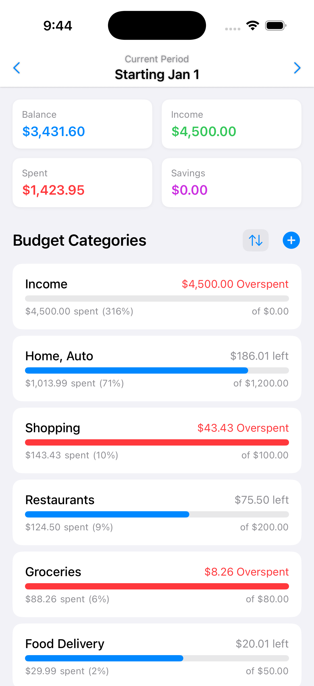
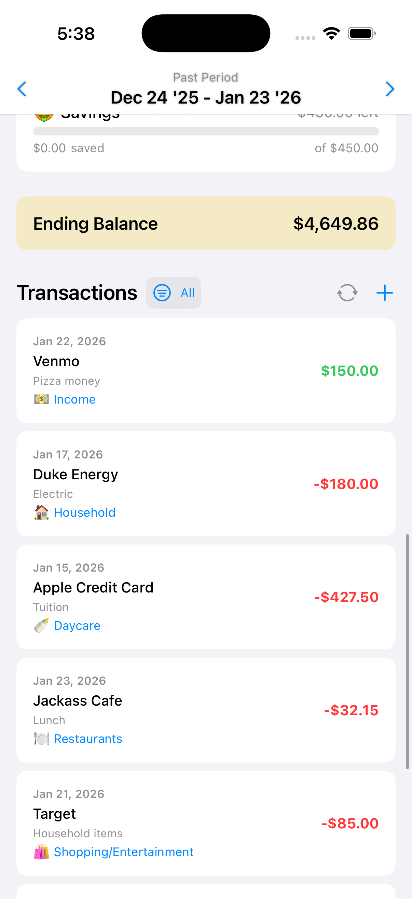
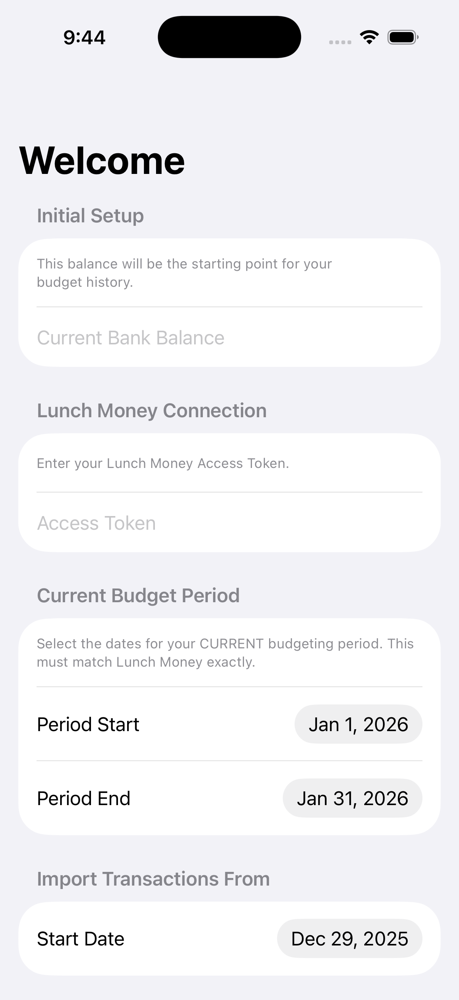
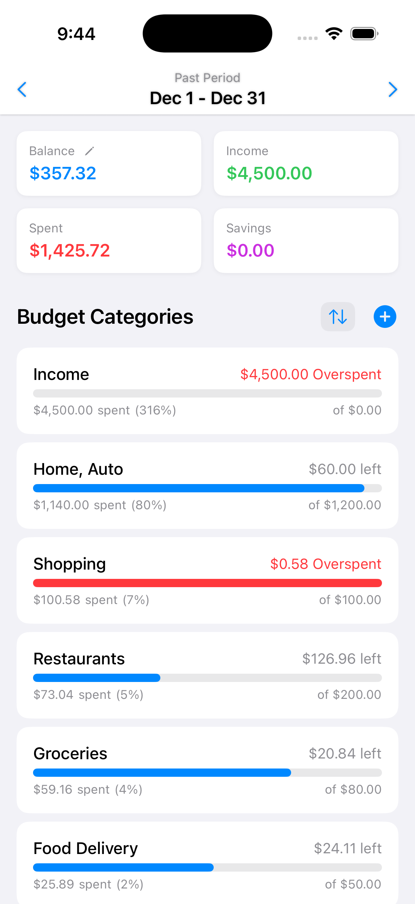
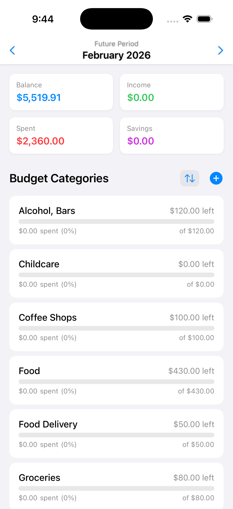

# MyBudget

A privacy-focused iOS budget tracker built with SwiftUI. Seamlessly syncs with the Lunch Money API to import transactions and trigger Plaid updates. Features dynamic category syncing, monthly budget tracking, and a clean, native interface. No external servers—your data connects directly from your device to Lunch Money.

# MyBudget - Lunch Money Companion App

A native iOS budget tracker built with SwiftUI that integrates directly with the [Lunch Money](https://lunchmoney.app/) API. 

This app is designed to be a privacy-first, lightweight mobile interface for your finances. It pulls your latest transactions and categories directly from your Lunch Money account, ensuring your mobile view always matches your main budget.

## 🚀 Features

* **Direct API Integration:** Connects directly to Lunch Money's v2 API. No intermediate servers or data collection.
* **Dynamic Category Syncing:** Categories are imported directly from your Lunch Money settings. Any changes made to categories on the web are reflected in the app.
* **Plaid Sync Trigger:** The "Sync Now" button triggers a fresh fetch from Plaid via Lunch Money, ensuring your data is always up to date.
* **Smart Categorization:** Uses your existing Lunch Money categorization rules and history.
* **Budget Progress:** Visual progress bars for every category to track spending vs. budget in real-time.
* **Local Manual Entry:** Quickly add cash transactions or pending items manually into the app.
* **Privacy Focused:** Your API token is stored securely on your device and used only for direct network calls to Lunch Money.

## 📱 Screenshots

### App Views
| Dashboard (Current) | Transaction List | Setup Screen |
|:---:|:---:|:---:|
|  |  |  |

### Budgeting Periods
| Past Period | Future Period |
|:---:|:---:|
|  |  |

## ⚙️ Setup & Installation

1.  **Prerequisites:**
    * A [Lunch Money](https://lunchmoney.app/) account.
    * Xcode 16.0+ installed on your Mac.
    * iOS 18.0+ device or simulator.

2.  **Get your API Token:**
    * Log in to Lunch Money.
    * Go to **Settings** > **Developers**.
    * Create or copy your **Access Token**.

3.  **Run the App:**
    ```bash
    git clone [https://github.com/yourusername/mybudget-ios.git](https://github.com/yourusername/mybudget-ios.git)
    cd mybudget-ios
    open MyBudget.xcodeproj
    ```
    * Select your target simulator or device in Xcode.
    * Press **Cmd + R** to build and run.

4.  **Initial Configuration:**
    * On the first launch, you will be prompted to enter your **Current Bank Balance** (to establish a baseline) and your **Lunch Money Access Token**.
    * Select a "Start Date" to pull transactions from.

## 🧩 Customization

### Categories & Budgets
Categories are no longer hardcoded! The app fetches your custom category list directly from Lunch Money. 
* **To change budgets:** Tap on any category row in the dashboard to set a new monthly limit for that specific category. The app will persist these overrides.

### Transaction Cleaning
The app uses Regex in `BudgetModels.swift` to clean up messy bank descriptions. You can modify the `uiName` property logic to filter out specific patterns relevant to your bank.

## 🤝 Contributing

Contributions are welcome! If you'd like to add features like charts, tag management, or Recurring Expenses support:

1.  Fork the repository.
2.  Create your feature branch (`git checkout -b feature/AmazingFeature`).
3.  Commit your changes (`git commit -m 'Add some AmazingFeature'`).
4.  Push to the branch (`git push origin feature/AmazingFeature`).
5.  Open a Pull Request.

## 📄 License

Distributed under the MIT License. See [License](LICENSE) for more information.

## 🙏 Acknowledgments

* Thanks to [Lunch Money](https://lunchmoney.app/) for providing an excellent API for personal finance.
* Built with ❤️ using SwiftUI.
